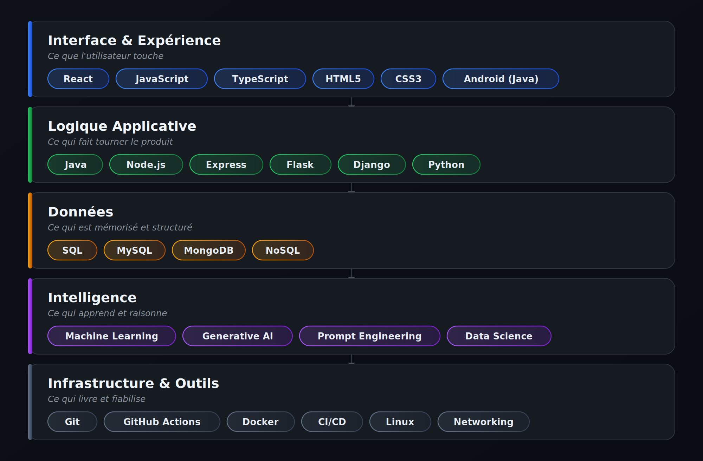

<!--
  ============================================================
  PROFIL GITHUB — AMINE EL MOUMEN (Amineelmoumen)
  ============================================================
  📌 À FAIRE avant publication :
  1. Ce README doit être placé dans un repo nommé exactement
     "Amineelmoumen/Amineelmoumen" (repo spécial de profil GitHub)
  2. IMPORTANT : uploader banner.png ET skills-architecture.png
     (PAS les .svg) à la RACINE du même repo, à côté du README.md.
     Le format PNG est utilisé volontairement : GitHub sert les SVG
     hébergés dans un repo avec un mauvais type de contenu (bug
     connu), ce qui empêche leur affichage. Le PNG n'a pas ce
     problème et fonctionne de manière garantie, sans dépendre
     d'aucun service externe.
  3. Remplacer [EMAIL] par ton adresse email pro si tu veux l'exposer
  4. Ajoute un lien "Portfolio" si tu en construis un un jour
  5. Les stats (github-readme-stats, streak-stats) restent des services
     externes tiers — généralement fiables, mais peuvent occasionnellement
     tomber en rate-limit (voir note plus bas)
  ============================================================
-->

<div align="center">


<br/><br/>

<em>Étudiant en IA & Data Science @ EMSI · Fullstack Developer · Java · Python · JavaScript</em>

<br/>

[](https://www.linkedin.com/in/amine-el-moumen/)
[](mailto:[EMAIL])
[](#)

</div>

<br/>

## 👋 Qui suis-je ?

Étudiant en **Intelligence Artificielle & Data Science** à l'**École Marocaine des Sciences de l'Ingénieur (EMSI)**, je me forme en parallèle en développement Fullstack — parce que je crois qu'un bon ingénieur IA doit aussi savoir construire, déployer et maintenir le produit qui portera ses modèles.

Mon approche : ne pas empiler les connaissances théoriques, mais les valider sur le terrain — stages, projets personnels, certifications pratiques. Depuis un an, j'ai suivi une trentaine de formations spécialisées (IBM, Coursera, LinkedIn Learning) pour construire une base solide en développement web, cloud, DevOps et intelligence artificielle.

```txt
class AmineElMoumen implements Engineer {
    private String formation   = "AI & Data Science — EMSI";
    private String[] domaines  = {"Fullstack Development", "Data Science", "DevOps", "AI"};
    private String mindset     = "Apprendre en construisant, pas seulement en lisant";
    private boolean curious    = true; // toujours vrai
}
```

<br/>

## 🎓 Formation & Expérience

**Formation**
- 🏫 **École Marocaine des Sciences de l'Ingénieur (EMSI)** — AI & Data Science

**Expérience professionnelle**

| Poste | Structure | Période | Contexte |
|---|---|---|---|
| 💻 Stagiaire | **Southydraulic** | Juil. 2025 | Développement d'une solution web innovante pour la gestion de projets hydrauliques |
| 🏥 Stagiaire en ingénierie informatique | **Clinique La Vallée** (Secteur Santé) | Juil. 2024 | Participation à la refonte du système d'information : analyse des besoins et proposition de solutions techniques |

<br/>

## 🎯 Ma vision de l'ingénierie

> La technologie a de la valeur seulement quand elle résout un vrai problème — pas quand elle empile des frameworks à la mode.

- 🧱 **Apprendre par la pratique** — chaque certification que je suis est choisie pour combler un manque concret, pas pour remplir un CV
- 🔄 **Relier IA et ingénierie logicielle** — un modèle sans produit qui le porte n'a pas d'impact
- 📖 **Comprendre avant d'implémenter** — le "pourquoi" compte autant que le "comment"

<br/>

## 🛠️ Stack technique — vue comme une architecture, pas comme une liste

Je n'ai pas listé mes compétences par ordre alphabétique. Je les ai organisées comme je construirais un vrai système : de ce que l'utilisateur voit jusqu'à ce qui fait tourner le tout en coulisses. C'est aussi ça, ma façon de penser l'ingénierie.

<div align="center">



</div>

<br/>

## 🚀 Projets phares

<table>
<tr>
<td width="50%" valign="top">

### 💧 Solution Web — Gestion de Projets Hydrauliques

**Contexte** : développée durant mon stage chez Southydraulic.

**Objectif** : digitaliser le suivi des projets hydrauliques de l'entreprise avec une interface web dédiée.

**Ce que ce projet démontre** : capacité à comprendre un besoin métier concret et à le traduire en solution technique utilisable en production.

</td>
<td width="50%" valign="top">

### 🏥 Refonte du Système d'Information — Clinique La Vallée

**Contexte** : stage au service informatique du secteur santé.

**Objectif** : analyser les besoins existants et proposer des solutions pour moderniser le système d'information.

**Ce que ce projet démontre** : rigueur d'analyse dans un environnement à forte exigence (données sensibles, continuité de service).

</td>
</tr>
<tr>
<td width="50%" valign="top">

### 📱 DevMobile — EmploiPub

**Objectif** : application Android permettant de rechercher et gérer des offres d'emploi depuis une interface mobile intuitive.

**Stack** : `Java` · Android SDK

[](https://github.com/Amineelmoumen/DevMobile)

</td>
<td width="50%" valign="top">

### ✅ Todo App

**Objectif** : application de gestion de tâches, terrain d'expérimentation pour les patterns front-end.

**Stack** : `JavaScript`

[](https://github.com/Amineelmoumen/todo-app)

</td>
</tr>
</table>

<br/>

## 📜 Certifications & Formations

Plus de 30 formations complétées, choisies pour construire une base cohérente entre développement logiciel, cloud/DevOps et intelligence artificielle.

### 🏆 Professional Certificates & Spécialisations

| Certification | Organisme | Détail |
|---|---|---|
| [IBM DevOps and Software Engineering](https://www.coursera.org/specializations/devops-and-software-engineering) | IBM | Professional Certificate · 15 cours |
| [IBM Full Stack Software Developer](https://www.coursera.org/specializations/ibm-full-stack-cloud-developer) | IBM | Professional Certificate · 12 cours |
| [IBM AI Developer](https://www.coursera.org/specializations/applied-artifical-intelligence-ibm-watson-ai) | IBM | Professional Certificate · 7 cours |
| [Core Java](https://www.coursera.org/specializations/core-java) | LearnQuest | Specialization · 4 cours |
| [Coding for Everyone: C and C++](https://www.coursera.org/specializations/coding-for-everyone) | UC Santa Cruz | Specialization · 4 cours |
| [ITIL 4 Certification](https://www.coursera.org/specializations/itil-4-certification) | EDUCBA | Specialization · 4 cours |
| [IBM Generative AI Engineering](https://www.coursera.org/specializations/ibm-generative-ai-engineering) | IBM | Specialization · en cours (16 cours) |

<details>
<summary><b>🤖 Intelligence Artificielle & Data Science (cliquer pour dérouler)</b></summary>
<br/>

- [Introduction to Artificial Intelligence (AI)](https://www.coursera.org/learn/introduction-to-ai/home/welcome) — IBM
- [Generative AI: Introduction and Applications](https://www.coursera.org/learn/generative-ai-introduction-and-applications/home/welcome) — IBM
- [Generative AI: Prompt Engineering Basics](https://www.coursera.org/learn/generative-ai-prompt-engineering-for-everyone/home/welcome) — IBM
- [Python for Data Science, AI & Development](https://www.coursera.org/learn/python-for-applied-data-science-ai/home/welcome) — IBM
- [Developing AI Applications with Python and Flask](https://www.coursera.org/learn/python-project-for-ai-application-development/home/welcome) — IBM
- [Machine Learning with Python](https://www.coursera.org/learn/machine-learning-with-python/home/welcome) — IBM
- [Introduction to Machine Learning](https://www.coursera.org/learn/machine-learning-duke/home/welcome) — Duke University
- [Building AI Powered Chatbots Without Programming](https://www.coursera.org/learn/building-ai-powered-chatbots/home/welcome) — IBM
- [Building AI Applications with Watson APIs](https://www.coursera.org/learn/building-ai-applications/home/welcome) — IBM
- [What is Data Science?](https://www.coursera.org/learn/what-is-datascience/home/welcome) — IBM
- [Tools for Data Science](https://www.coursera.org/learn/open-source-tools-for-data-science/home/welcome) — IBM
- [Introduction to Data Analytics](https://www.coursera.org/learn/introduction-to-data-analytics/home/welcome) — IBM
- [Introduction to Big Data](https://www.coursera.org/learn/big-data-introduction/home/welcome) — UC San Diego (via Honoris)
- [Introduction to NoSQL Databases](https://www.coursera.org/learn/introduction-to-nosql-databases/home/welcome) — IBM
- [Databases and SQL for Data Science with Python](https://www.coursera.org/learn/sql-data-science/home/welcome) — IBM

</details>

<details>
<summary><b>🌐 Développement Web & Logiciel (cliquer pour dérouler)</b></summary>
<br/>

- [Introduction to Web Development with HTML, CSS, JavaScript](https://www.coursera.org/learn/introduction-to-web-development-with-html-css-javacript/home/welcome) — IBM
- [HTML, CSS, and Javascript for Web Developers](https://www.coursera.org/learn/html-css-javascript-for-web-developers/home/welcome) — Johns Hopkins University
- [Developing Front-End Apps with React](https://www.coursera.org/learn/developing-frontend-apps-with-react/home/welcome) — IBM
- [Developing Back-End Apps with Node.js and Express](https://www.coursera.org/learn/developing-backend-apps-with-nodejs-and-express/home/welcome) — IBM
- [Django Application Development with SQL and Databases](https://www.coursera.org/learn/developing-applications-with-sql-databases-and-django/home/welcome) — IBM
- [Java Programming: Solving Problems with Software](https://www.coursera.org/learn/java-programming/home/welcome) — Duke University
- [Programming Foundations with JavaScript, HTML and CSS](https://www.coursera.org/learn/duke-programming-web/home/welcome) — Duke University
- [Introduction to Software Engineering](https://www.coursera.org/learn/introduction-to-software-engineering/home/welcome) — IBM
- [Software Engineering: Software Design and Project Management](https://www.coursera.org/learn/software-engineering-software-design-and-project-management/home/welcome) — The Hong Kong University of Science and Technology

</details>

<details>
<summary><b>☁️ Cloud, DevOps & Systèmes (cliquer pour dérouler)</b></summary>
<br/>

- [Introduction to DevOps](https://www.coursera.org/learn/intro-to-devops/home/welcome) — IBM
- [Introduction to Cloud Computing](https://www.coursera.org/learn/introduction-to-cloud/home/welcome) — IBM
- [Introduction to Agile Development and Scrum](https://www.coursera.org/learn/agile-development-and-scrum/home/welcome) — IBM
- [Getting Started with Git and GitHub](https://www.coursera.org/learn/getting-started-with-git-and-github/home/welcome) — IBM
- [Hands-on Introduction to Linux Commands and Shell Scripting](https://www.coursera.org/learn/hands-on-introduction-to-linux-commands-and-shell-scripting/home/welcome) — IBM
- [Introduction to Containers w/ Docker, Kubernetes & OpenShift](https://www.coursera.org/learn/ibm-containers-docker-kubernetes-openshift/home/welcome) — IBM
- [Application Development using Microservices and Serverless](https://www.coursera.org/learn/applications-development-microservices-serverless-openshift/home/welcome) — IBM
- [Introduction to Test and Behavior Driven Development](https://www.coursera.org/learn/test-and-behavior-driven-development-tdd-bdd/home/welcome) — IBM
- [Continuous Integration and Continuous Delivery (CI/CD)](https://www.coursera.org/learn/continuous-integration-and-continuous-delivery-ci-cd/home/welcome) — IBM
- [Application Security for Developers and DevOps Professionals](https://www.coursera.org/learn/application-security-for-developers-devops/home/welcome) — IBM
- [Monitoring and Observability for Development and DevOps](https://www.coursera.org/learn/monitoring-and-observability-for-development-and-devops/home/welcome) — IBM
- [DevOps Capstone Project](https://www.coursera.org/learn/devops-capstone-project/home/welcome) — IBM
- [Full Stack Application Development Capstone Project](https://www.coursera.org/learn/ibm-cloud-native-full-stack-development-capstone/home/welcome) — IBM
- The Unix Workbench — Johns Hopkins University

</details>

<details>
<summary><b>📡 Réseaux & Systèmes embarqués (cliquer pour dérouler)</b></summary>
<br/>

- [Basics of Cisco Networking](https://www.coursera.org/learn/basics-of-cisco-networking/home/welcome) — LearnQuest
- [Introduction to TCP/IP](https://www.coursera.org/learn/tcpip/home/welcome) — Yonsei University
- Networking Basics — Cisco Networking Academy
- [Interfacing with the Arduino](https://www.coursera.org/learn/interface-with-arduino/home/welcome) — UC Irvine
- [Introduction to the Internet of Things and Embedded Systems](https://www.coursera.org/learn/iot/home/welcome) — UC Irvine
- [The Arduino Platform and C Programming](https://www.coursera.org/learn/arduino-platform/home/welcome) — UC Irvine

</details>

<details>
<summary><b>📊 Gestion de projet, Gouvernance & Outils (cliquer pour dérouler)</b></summary>
<br/>

- [Agile Project Management](https://www.coursera.org/learn/agile-project-management/home/welcome) — Google (via Honoris)
- [COBIT 2019 Framework Essentials](https://www.coursera.org/learn/cobit-2019/home/welcome) — LearnKartS
- [Notion for Beginners: Create a Project Plan](https://www.coursera.org/learn/notion-for-beginners-create-a-project-plan/home/welcome) — Coursera
- [Getting Started with Microsoft Excel](https://www.coursera.org/learn/introduction-microsoft-excel/home/welcome) — Coursera
- Career Essentials in Software Development by Microsoft and LinkedIn
- Career Essentials in Generative AI by Microsoft and LinkedIn
- Practical GitHub Actions — LinkedIn

</details>

<details>
<summary><b>🖥️ Langages & Fondamentaux (cliquer pour dérouler)</b></summary>
<br/>

- Master Java, Python, C & C++: All-in-One Programming Course — Udemy
- Java Fundamentals Course For Beginners — Udemy
- Core Java (4 cours : Introduction to Java, OOP with Java, Object-Oriented Hierarchies, Java Class Library) — LearnQuest
- Coding for Everyone (4 cours : C fondamentaux et structuré, C++ Parts A & B) — UC Santa Cruz

</details>

<details>
<summary><b>🌍 Langues & Culture (cliquer pour dérouler)</b></summary>
<br/>

- [Étudier en France: French Intermediate course B1–B2](https://www.coursera.org/learn/etudier-en-france/home/welcome) — École Polytechnique
- Preparatory Faculty — Russian Language — Kharkiv Institute of Trade and Economics

</details>


<br/>

## 📊 Activité & Statistiques

<div align="center">


</div>

<br/>

## 🧭 Feuille de route 2026–2027

- [ ] Approfondir le Machine Learning et le Deep Learning appliqués
- [ ] Construire un projet complet alliant IA et développement web (bout en bout)
- [ ] Contribuer à un projet open source
- [ ] Décrocher un stage/alternance en IA Engineering ou Fullstack Development
- [ ] Publier mes premiers retours d'expérience techniques

<br/>

## 📫 Me contacter

<div align="center">

Ouvert aux opportunités de stage, d'alternance et de collaboration sur des projets IA / Fullstack.

[](https://www.linkedin.com/in/amine-el-moumen/)
[](mailto:[EMAIL])

<br/>


</div>
